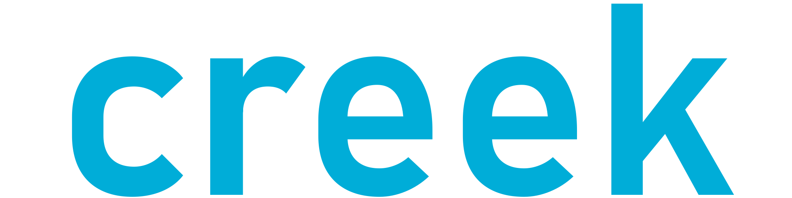

<div align="center">
    
</div>
<div align="center">
    <a href="https://github.com/phial3/creek">Creek</a> is a fully-featured Streams library 
    for <a href="https://go.dev/">Go</a>. <br>
    Creek creates wrappers around a specific data source (array or slice), allowing us to operate with that data source and making bulk processing convenient and fast.
    Creek helps you to follow the <a href="https://en.wikipedia.org/wiki/Functional_programming">functional programming</a> paradigms.   
    It's not just a Streams library, you can work with arrays and slices more easily than ever.
</div>
<br>
<div align="center">
    <a href="https://github.com/phial3/creek/blob/master/go.mod">
        
    </a>
    <a href="https://github.com/phial3/creek/releases">
        
    </a>
    <a href="https://pkg.go.dev/github.com/phial3/creek">
        
    </a>
    <a href="https://goreportcard.com/report/github.com/phial3/creek">
        
    </a>
    <a href="https://github.com/phial3/creek/actions">
        
    </a>
    <a href="https://github.com/phial3/creek/blob/master/LICENSE">
        
    </a>
</div>

<hr>

# Table of Contents
- [Table of Contents](#table-of-contents)
  - [Why creek?](#why-creek)
  - [Installation](#installation)
  - [Quick start](#quick-start)
  - [Create stream](#create-stream)
    - [Stream from primitive types](#stream-from-primitive-types)
    - [Stream from struct arrays](#stream-from-struct-arrays)
    - [Create stream from maps](#create-stream-from-maps)
  - [Method chaining](#method-chaining)
  - [Download and build from source](#download-and-build-from-source)
  - [Creek VS Linq VS Java Streams API](#creek-vs-linq-vs-java-streams-api)
    - [Linq](#linq)
    - [Java Streams API](#java-streams-api)
    - [Creek](#creek)
  - [Contributing](#contributing)
  - [License](#license)

<hr>

## Why creek?
If you've always missed the functional programming paradigms from Golang, or ever wanted to work with streams in Go, this library will totally fit your needs.  
If you are from a [C#](https://docs.microsoft.com/en-us/dotnet/csharp/) or a [Java](https://www.java.com/en/) background, working with this library going to be easy since creek is very similar to [Linq](https://docs.microsoft.com/en-us/dotnet/csharp/programming-guide/concepts/linq/) or the [Java Streams API](https://docs.oracle.com/javase/8/docs/api/java/util/stream/package-summary.html).  
Even if you just want to work with slices and arrays more conveniently and easily, but don't like functional programming, you can do that too.

<hr>

## Installation
Before installing this library, you need to have [Go](https://go.dev/dl/) installed.  
> Since creek uses generics, version 1.18+ is required.  

Now, you can initialize a project and use this library:  
```sh
go get -u github.com/phial3/creek
```

<hr>

## Quick start
```go
package main

import (
    "fmt"

    "github.com/phial3/creek"
)

func main() {
    arr := []int{1, 8, 2, 14, 22, 4, 7, 92}

    result := creek.FromArray(arr).Filter(func(item int) bool {
        return item > 3
    }).OrderBy().Collect()

    fmt.Println(result) // [4 7 8 14 22 92]
}
```

<hr>

## Create stream
You can create a stream from almost every type of array or slice.  

### Stream from primitive types
There are 53 functions you can use with this type of stream. (E.g: `Filter`, `Map`, `OrderBy`, etc..).  
You can find them documented [here](docs/STREAMS.md).  

> **Important:** The functions do not modify the original array or the previous stream. Most of the functions return a new stream.

The supported types are the following:
> ```go
> string, byte, float32, float64, int, int16, int32, int64, uint16, uint32, uint64
> ```

```go
// --== Create an empty stream ==--
emptyStream := creek.Empty[int]()
```

```go
// --== Stream from an existing array or slice ==--

// slice
arr := []int{1, 8, 2, 14, 22, 4, 7, 92}
intStream := creek.FromArray(arr)

// array
arr2 := [3]string{"One", "Two", "Three"}
stringStream := creek.FromArray(arr2[:])
```

```go
// --== Stream from parameter values ==--
stream := creek.FromValues("Apple", "Strawberry", "Peach")
```

```go
// --== Stream from a file ==--
// The file is read line by line. Each line is an element of the stream.
file, _ := os.Open("/path/to/file.txt")
stream := creek.FromFile(file)
```

### Stream from struct arrays
The `FromStruct` function creates a new stream from the given struct array.  
If the given array is not made of struct, it throws an error.  

There are 49 functions you can use with this type of stream. (E.g: `Filter`, `Map`, `OrderBy`, etc..).  
You can find them documented [here](docs/STRUCTS.md).  

> **Important:** The functions do not modify the original array or the previous stream. Most of the functions return a new stream.

```go
type YourStruct struct {
	Id   int64
	Name string
}

func yourFunction() {
	structArray := []YourStruct{
		{Id: 1, Name: "John"},
		{Id: 2, Name: "Will"},
		{Id: 3, Name: "Mark"},
	}

	structStream := creek.FromStructs(structArray)
}
```
If you use this stream, there are some functions, where you need to pass the name of the field in order to work. 
These functions are the following:  
`Average`, `Max`, `MaxIndex`, `Min`, `MinIndex`, `OrderBy`, `OrderByDescending`, `Sum`.  
For example:
```go
structArray := []YourStruct{
    {Id: 1, Name: "John"},
    {Id: 2, Name: "Will"},
    {Id: 3, Name: "Mark"},
}

// The functions are case sensitive. 'name', 'nAme', or 'nAMe' won't work.
// Make sure you spell it correctly, otherwise it throws an error.
structStream := creek.FromStructs(structArray).OrderBy("Name")
```

### Create stream from maps
There are 37 functions you can use with this type of stream.  
You can find them documented [here](docs/MAPS.md).  

> **Important:** The functions do not modify the original array or the previous stream. Most of the functions return a new stream.

The supported key and value types are the following:
> ```go
> string, byte, float32, float64, int, int16, int32, int64, uint16, uint32, uint64
> ```

```go
// --== Stream from an existing map ==--
arr := map[int]string{
    1: "Mark",
    2: "John",
    3: "Jack",
}

stream := creek.FromMap(arr)
```

```go
// --== Create an empty stream ==--
// [key, value]
empty := creek.EmptyMap[int, string]()
```

<hr>

## Method chaining
With **creek**, method chaining is very straightforward and easy to read.  
This code below: 
- filters the array, so only the even numbers stay
- multiplies every number by 3
- sorts the array in descending order
- constrains the array to the length of 5
- collects the array from the stream
```go
arr := []int{2, 7, 3, 1, 12, 6, 82, 101, 23, 24, 72, 13, 7}

result := creek.FromArray(arr).Filter(func(item int) bool {
    return item%2 == 0
}).Map(func(item int) int {
    return item * 3
}).OrderByDescending().Limit(5).Collect()

// result: [246, 216, 72, 36, 18]
```

<hr>

## Download and build from source
Cloning the repository:
```sh
https://github.com/phial3/creek.git
cd creek
```
- Running the tests: `make test`
- Running the test in detailed version: `make test_detailed`
- Test coverage: `make test_coverage`
- Go formatting: `make fmt`
- Docs: `make docs`
- Go vet: `make vet`

<hr>

## Creek VS Linq VS Java Streams API
Creek is quite similar compared to these libraries.  
Here you can see the similarities between Creek, Linq, and Java Streams API.  
The expected output is the following:
```
4
8
12
16
```

### Linq
```cs
List<int> list = new List<int>{ 1, 7, 2, 5, 9, 6, 3, 4, 8 };
var result = list
    .Where(num => num % 2 == 0)
    .Select(num => num * 2)
    .OrderBy(num => num)
    .ToList();

result.ForEach(num => Console.WriteLine(num));
```

### Java Streams API
```java
List<Integer> list = List.of(1, 7, 2, 5, 9, 6, 3, 4, 8);
List<Integer> result = list
        .stream()
        .filter(num -> num % 2 == 0)
        .map(num -> num * 2)
        .sorted()
        .toList();

result.forEach(System.out::println);
```

### Creek
```go
list := creek.FromValues(1, 7, 2, 5, 9, 6, 3, 4, 8)
result := list.Filter(func(num int) bool {
    return num%2 == 0
}).Map(func(num int) int {
    return num * 2
}).OrderBy().Collect()

creek.FromArray(result).ForEach(func(num int) {
    fmt.Println(num)
})
```

<hr>

## Contributing
Every contribution is welcomed.  
You can find a contribution guideline [here](CONTRIBUTING.md).  

<hr>

## License
This project is licensed under the [MIT License](LICENSE).